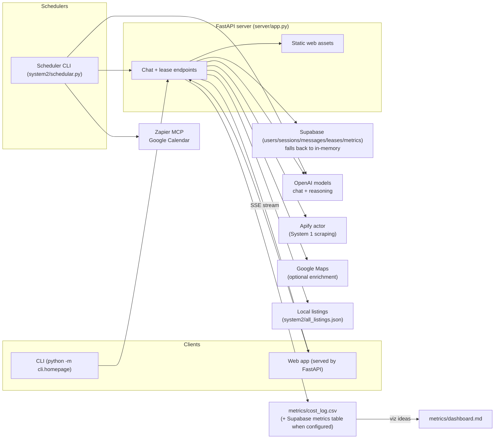

# Aptiva Rental Assistant

Aptiva is a dual-market rental assistant that serves two personas-aware agents:
- **System 1 (US)**: Apartments.com-focused agent with Apify scraping, Google Maps enrichment, and lease drafting.
- **System 2 (Lebanon)**: Local agency agent using curated JSON listings, Zapier MCP calendar scheduling, and lease drafting.
The project ships a CLI, a FastAPI backend (which also serves the web app), and a scheduler CLI for calendar operations.

## Architecture

FastAPI mounts the compiled agents and serves the web UI; Supabase is used when available, otherwise an in-memory store keeps sessions alive for demos.

## Prerequisites & Installation
- Python 3.10+ and `pip`.
- Virtual environment recommended.
- Supabase project (optional but needed for persistence and metrics); see expected tables in `storage/supabase_store.py` (users, sessions, conversations, messages, lease_drafts, metrics).
- Optional: Apify account (System 1 scraping), Google Maps API key (enrichment), Zapier MCP Google Calendar connection (scheduling).

Install steps:
1) `python -m venv .venv && source .venv/bin/activate` (Windows: `.venv\\Scripts\\activate`)
2) `pip install -r requirements.txt`
3) Copy `.env.example` (if you keep one) or export the env vars below before running.

## How to Run
- **CLI menu**: `python -m cli.homepage` (add `--location us` or `--location lb` to skip prompts).
- **US agent REPL only**: `python -m system1.real_estate_agent`
- **Lebanon agent REPL only**: `python -m system2.real_estate_agent`
- **FastAPI server**: `uvicorn server.app:app --reload --port 8000`
  - The web app is served from `/` (static assets under `webapp/`); SSE chat stream is at `/api/chat/stream`.
- **Scheduler CLI** (calendar tools / debugging): `python -m system2.schedular`
- **Homepage router from CLI**: `python main.py` (wraps the CLI menu above).
- **Docker image**:
  ```bash
  docker run -it --rm \
    -p 8000:8000 \
    -e OPENAI_API_KEY="your_openai_key" \
    -e GOOGLE_MAPS_API_KEY="your_google_maps_key" \
    -e APIFY_TOKEN="your_apify_token" \
    -e SUPABASE_URL="your_supabase_url" \
    -e SUPABASE_SERVICE_ROLE_KEY="your_supabase_service_role_key" \
    -e RAPIDAPI_KEY="your_rapidapi_key" \
    shafikhw/aptiva:latest
  ```
  Or load everything from `.env`:
  ```bash
  docker run -it --env-file .env --rm -p 8000:8000 shafikhw/aptiva:latest
  ```

## Environment Configuration
| Variable | Purpose | Default |
| --- | --- | --- |
| `OPENAI_API_KEY` | Required for all OpenAI calls (agents + scheduler). | _none_ |
| `OPENAI_MODEL` | Chat model for agents. | `gpt-4o-mini` |
| `OPENAI_REASONING_MODEL` | Reasoning model for lease helpers. | `o4-mini` |
| `OPENAI_TIMEOUT` / `OPENAI_MAX_RETRIES` | HTTP timeout and retry count for OpenAI requests. | `30` / `3` |
| `SUPABASE_URL` / `SUPABASE_SERVICE_ROLE_KEY` | Enables Supabase-backed storage/metrics; falls back to memory when absent. | _none_ |
| `APIFY_API_TOKEN` or `APIFY_TOKEN` | Required for Apartments.com scraping (System 1). | _none_ |
| `APIFY_ACTOR_ID` | Override the Apify actor used for scraping. | `BvepfniODI2AixuNN` |
| `APIFY_TIMEOUT_SECONDS` / `APIFY_MAX_RETRIES` | Scraper timeout and retries. | `120` / `2` |
| `GOOGLE_MAPS_API_KEY` | Optional listing enrichment (geocode + POIs). | _none_ |
| `ZAPIER_MCP_URL` / `ZAPIER_MCP_TOKEN` | Zapier MCP endpoint + token for Google Calendar tools. | defaults in code / _none_ |
| `USER_CAL_ID` / `LANDLORD_CAL_ID` | Calendar IDs used by the scheduler. | sample Gmail IDs in code |
| `LISTING_TITLE` / `LISTING_ADDRESS` | Default context for scheduler-created events. | `Oskar Luxury Apartments` / `572 11th Ave...` |
| `MCP_TIMEOUT` / `MCP_MAX_RETRIES` | Zapier MCP call timeout (seconds) and retries. | `30` / `3` |
| `LOG_LEVEL` | Logging level for telemetry. | `INFO` |

## Metrics, Dashboards, and Cost Log
- Metrics are persisted to `metrics/cost_log.csv` locally and to the Supabase `metrics` table when Supabase is configured. A sample file is committed for dashboards and documentation.
- `metrics/dashboard.md` notes quick visualization ideas (load the CSV into notebooks or wire up Prometheus).
- Both `README.md` and `docs/experiments.md` reference `metrics/cost_log.csv` so you can plug in dashboards without running a fresh workload.

## Notes
- Supabase schema expectation: tables for users, sessions, conversations (with `state`, `persona_mode`, `preferences`), messages (`role`, `content`, `timestamp`), lease_drafts (metadata + base64 payload), and metrics (columns mirror `metrics/cost_log.csv`). See `storage/supabase_store.py` for exact field usage.
- The web app consumes SSE from the server; keep `uvicorn` running when developing the UI.
